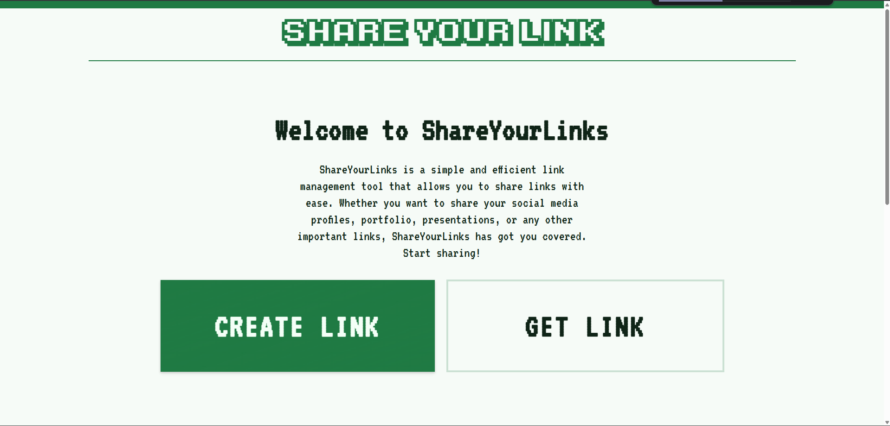
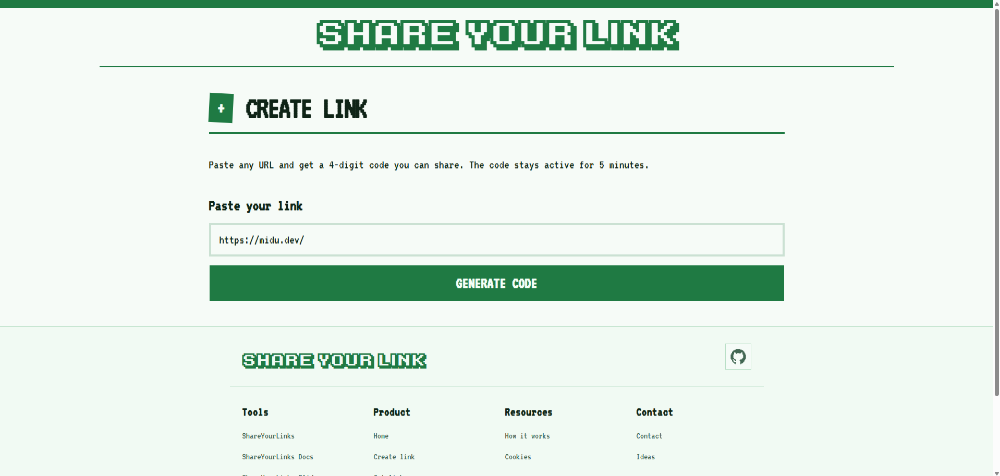
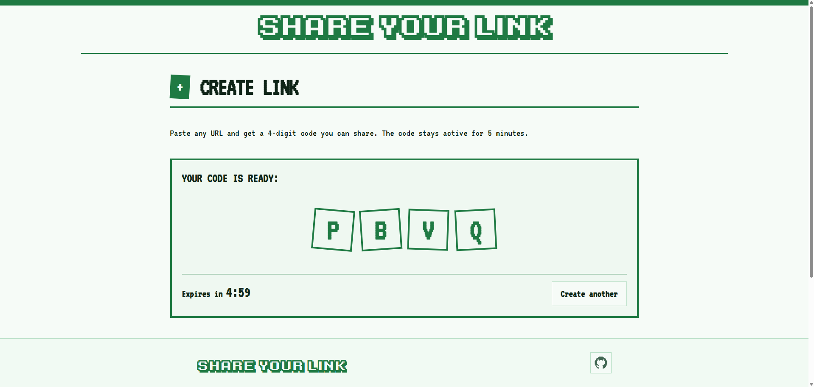
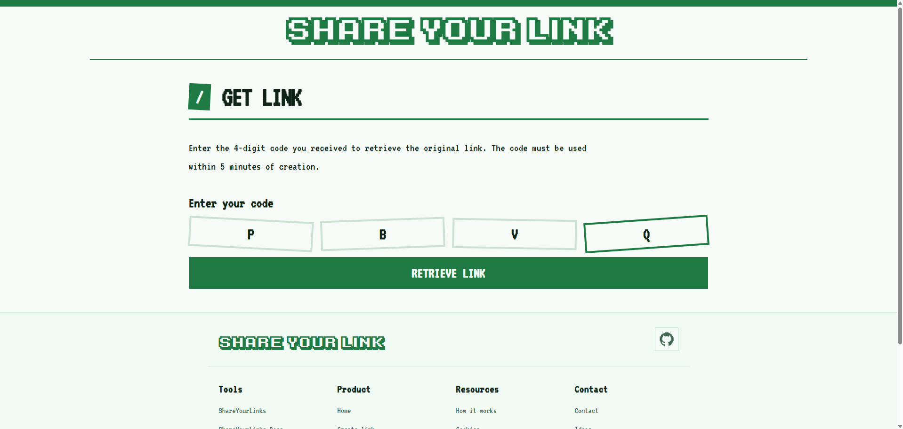
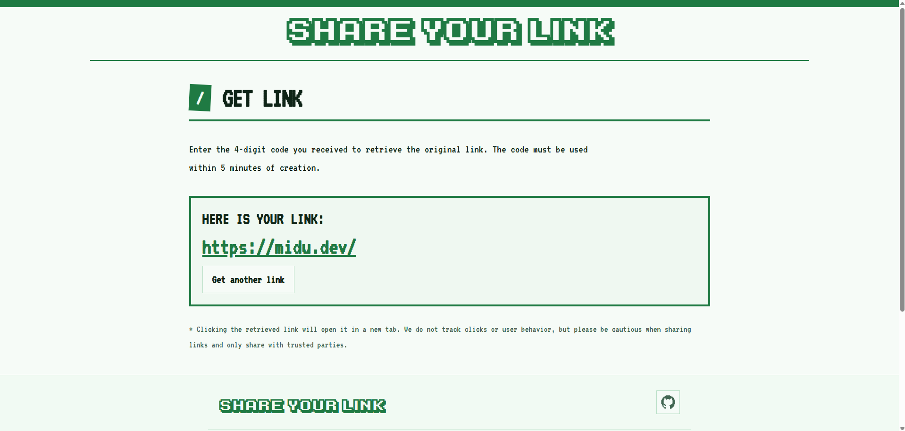
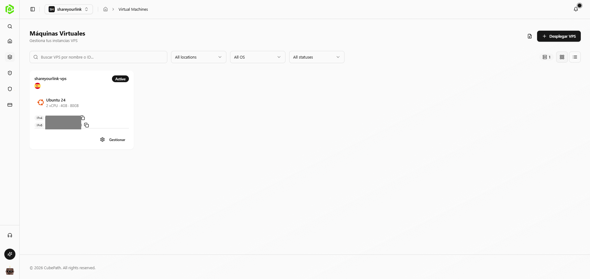
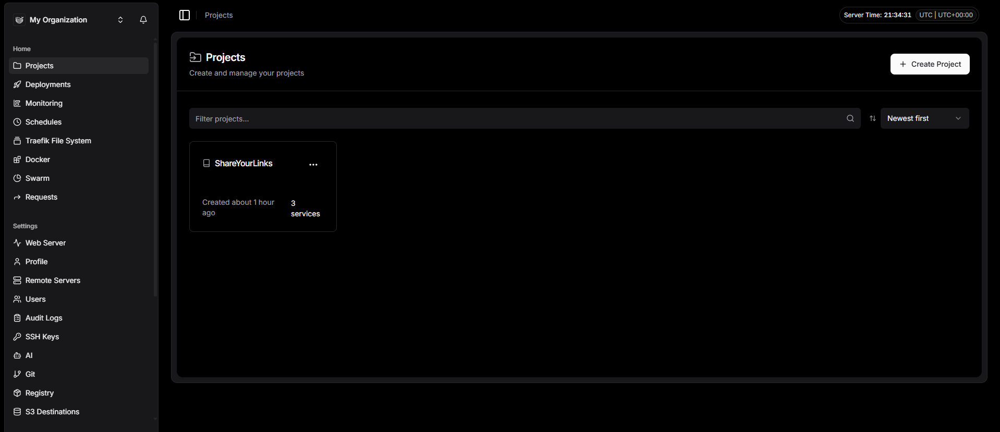
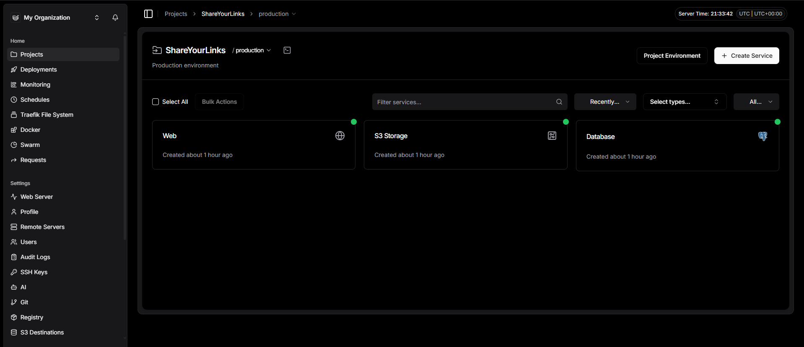

# ShareYourLinks

Comparte enlaces y archivos de forma temporal mediante códigos cortos. ShareYourLink permite crear un código en segundos para enviar una URL, un documento o una presentación, y recuperarlo antes de que expire.

## Descripcion

`ShareYourLinks` es una aplicación web orientada a compartir contenido rápido sin cuentas ni configuraciones complejas. La idea se me ocurrió porque un día necesitaba pasar un enlace a un PC de un aula de la universidad y me daba pereza iniciar sesión o buscar el enlace concreto, así que pensé que estaría bien tener una herramienta que con un simple código de 4 dígitos me solucionase el problema (otros casos de uso pueden ser compartir enlaces en ordenadores públicos de hoteles, bibliotecas, etc.). Además, una vez lo tenía se me quedaba un poco corto y, como el primer enlace que quería compartir en el aula era para pasar un documento, se me ocurrió que sería interesante poder compartir también documentos y presentaciones con el mismo sistema.

ShareYourLinks se resume en:

- Generar códigos únicos para compartir contenido.
- Expiración automática a los 5 minutos para reducir persistencia innecesaria.
- Soporte para 3 flujos principales:
  - enlaces (`http/https`)
  - documentos (`.pdf`, `.doc`, `.docx`)
  - presentaciones (`.ppt`, `.pptx`)
- Sistema de protección con rate limiting y control de intentos fallidos.
- Interfaz multilenguaje (ES/EN).

## Enlace a la demo

- Demo online: `https://shareyourlinks.app`

## Capturas / GIFs

### 1) Landing

`[CAPTURA DE PANTALLA: landing principal]`

### 2) Flujo de crear enlace

`[CAPTURA DE PANTALLA:: pegar URL -> generar codigo -> contador de expiracion]`

### 3) Flujo de recuperar enlace

`[CAPTURA DE PANTALLA: pantalla de recuperar por codigo]`

## Valor del proyecto

- **Rapidez**: en pocos pasos se obtiene un código listo para compartir.
- **Privacidad temporal**: el contenido no se conserva de forma indefinida.
- **Simplicidad de uso**: no requiere registro para los flujos principales.
- **Aplicabilidad real**: útil para compartir recursos entre compañeros, equipos o sesiones rápidas.

## Tecnologias principales

- Next.js 16
- Prisma + PostgreSQL
- MinIo como S3 compatible storage (subida y acceso mediante URLs firmadas)

## Como CUBEPATH me a ayudado a desarrollar este proyecto

Cubepath ha sido de gran utilidad para poder desplegar el proyecto de forma rápida y sencilla; yo he optado por una VPS en concreto la "gp.micro". Lo primero que he hecho ha sido elegir Ubuntu 24 como SO, luego ya he configurado Tailscale y Dockploy. A partir de aquí todo el proceso de despliegue ha sido muy sencillo, simplemente he configurado los servicios que necesitaba desde el panel web de Dockploy; en mi caso PostgreSQL, un contenedor con MinIO como almacenamiento y por último el que contiene la aplicación, la verdad que está genial. Gracias a Cubepath he podido centrarme en el desarrollo del proyecto sin tener que preocuparme por la infraestructura o el despliegue, lo cual me ha permitido avanzar mucho más rápido y con menos complicaciones.

### Capturas del proceso de todo el proceso de despliegue

#### 1) VPS de Cubepath

`[CAPTURA DE PANTALLA: panel de control de Cubepath]`

#### 2) Panel de control de Dockploy

`[CAPTURA DE PANTALLA: panel de control de Dockploy]`

#### 3) Configuracion de servicios en Dockploy

`[CAPTURA DE PANTALLA: configuracion de servicios en Dockploy]`

## Conclusión

Para terminar, no puedo cerrar este README sin expresar mi más sincero agradecimiento a Midudev y a todo el equipo de Cubepath por organizar esta hackatón y brindarnos plataformas que realmente facilitan la vida al desarrollador. Soy consciente de que mi proyecto no usa IA (un fracaso para muchos jajaj); sin embargo, he decidido no hacer nada relacionado con esta ya que no lo veia necesario. Mi herramienta nace de una necesidad real y cotidiana, priorizando la utilidad práctica y la inmediatez por encima de las modas. Gracias por última vez y un saludo a toda la comunidad. ¡Nos vemos en la próxima!
